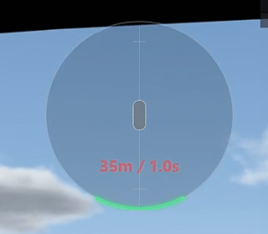
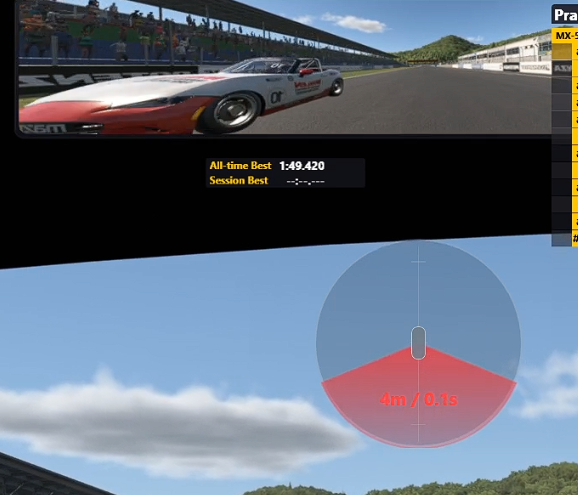
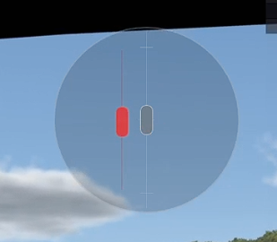
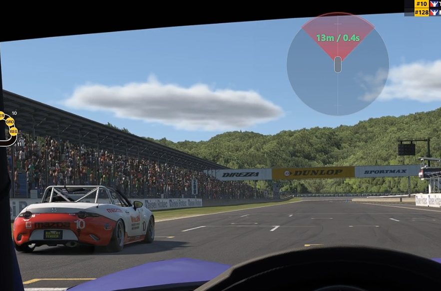

# iRacing Radar for SimHub

[中文](#readme-zh) | [English](#readme-en)

<a id="readme-zh"></a>

## 中文说明

一个用于 iRacing 的 SimHub 车辆雷达覆盖层。下载编译好的发布包后，直接解压到 SimHub 根目录即可使用。

> **重要提示：** 当车辆位于本车侧面时，雷达只能显示车辆在左侧还是右侧，以及它相对本车偏前或偏后；**无法提供两车之间的实际横向距离**。侧面红色标记的位置和间隔不能作为横向间距或碰撞余量使用。

### 演示视频

[](https://youtu.be/-9Pv4CWri6g)

点击上方图片在 YouTube 观看雷达演示。

### 雷达状态说明

雷达中央的灰色区域代表本车，上方代表车头方向，下方代表车尾方向。以下四张图按顺序展示一辆对手车辆从后方靠近、并排超车，再到前方远离时的雷达画面。

#### 1. 后方远处靠近



雷达下方出现绿色弧形，表示后方提示范围内有车。距离和时差显示为红色时，表示后车正在接近。

#### 2. 车辆逼近



后车靠近时，下方提示逐渐变为红色扇形。车辆越近，红色区域越宽、颜色越明显。

#### 3. 车辆并排



车辆并排时，本车左侧或右侧会出现红色车辆标记。标记偏上表示对手更靠近本车车头，偏下表示更靠近本车车尾。并排状态不显示距离和时差。

#### 4. 超车后远离



对手完成超车后，提示出现在雷达上方。距离和时差显示为绿色时，表示前车正在远离。随着距离增大，前方红色提示变为绿色弧形，最后从雷达上消失。

### 其他视觉状态

- 附近没有车辆时，整个雷达自动隐藏。
- 前后车辆距离小于 2.5 米时，距离和时差文字隐藏，图形警示继续显示。
- 红色文字表示车辆正在靠近，绿色文字表示车辆正在远离。
- 侧面车辆只显示红色位置标记，不显示文字数值。

### 安装

先关闭 SimHub。下载发布包后，把 ZIP **直接解压到 SimHub 根目录**：

```text
C:\Program Files (x86)\SimHub
```

压缩包已经包含完整目录结构，不需要创建文件夹或分别移动文件。解压后的结构应为：

```text
SimHub\
├─ User.IRacingRadarPlugin.dll
├─ IRacingRadar.settings.ini
└─ DashTemplates\
   └─ iRacing Radar\
      ├─ iRacing Radar.djson
      └─ iRacing Radar.djson.ressources
```

解压完成后：

1. 启动 SimHub。
2. 在 SimHub 插件列表中启用 **iRacing Radar**。
3. 在 Dash Studio / Overlays 中启动 **iRacing Radar**。
4. 启动 iRacing。建议使用无边框或窗口模式，方便 Windows overlay 正常显示。

### 配置文件位置

推荐把配置文件放在 DLL 同目录：

```text
C:\Program Files (x86)\SimHub\IRacingRadar.settings.ini
```

插件会优先读取这个文件。如果找不到，会兼容旧位置：

```text
%USERPROFILE%\Documents\iRacingRadar\IRacingRadar.settings.ini
%USERPROFILE%\Documents\iraing_Rader\IRacingRadar.settings.ini
```

### 配置项说明

```ini
DisplayMode=Both
```

控制前后车辆显示哪些数字，并决定使用距离条件、时间差条件还是两者来显示图形警示。

- `None`：不显示距离和时差文字；图形警示仍然正常显示，并采用与 `Both` 相同的触发条件。
- `Distance`：只看距离条件，只显示米数。
- `Time`：只看时间差条件，只显示秒数。
- `Both`：距离或时间差只要有一个达到设定范围，就显示图形警示，并同时显示米数和秒数。

```ini
RadarRangeMeters=70
```

距离条件的范围，单位是米。设置为 `70` 表示前后车辆距离本车不超过 70 米时，距离条件成立。

雷达会在距离范围最外侧的 15% 区间内按比例渐显。例如范围为 70 米时，70 米处透明度为 0，65 米处于渐显状态，约 59.5 米及以内完全显示。

- `DisplayMode=Distance`：只根据这个距离判断是否提示。
- `DisplayMode=Both` 或 `None`：距离条件和时间差条件满足任意一个，都会显示图形警示。
- `DisplayMode=Time`：不使用这个距离条件。

```ini
TimeAlertSeconds=0.7
```

**这是时间差提示范围。** 它决定前后车辆与本车的时间差达到多少秒时开始提示。设置为 `0.7` 时，时间差大于 0.7 秒不提示，时间差不超过 0.7 秒就进入提示范围。

这个参数是否使用，由 `DisplayMode` 决定：

- `Time`：只使用 `TimeAlertSeconds` 判断是否提示。
- `Both`：同时检查 `TimeAlertSeconds` 和 `RadarRangeMeters`，任意一个条件满足就提示。
- `Distance`：不使用 `TimeAlertSeconds`。
- `None`：判断方式与 `Both` 相同，但隐藏距离和时间差文字。

因此，`TimeAlertSeconds` 只需要配合 `DisplayMode` 使用，不需要配合 `RadarFadeBandPercent`。

例如同时设置 `RadarRangeMeters=70` 和 `TimeAlertSeconds=0.7`：车辆相距 60 米但时间差为 1.0 秒时，距离条件成立；车辆相距 90 米但时间差为 0.5 秒时，时间差条件成立。`Both` 和 `None` 在这两种情况下都会显示图形警示，但 `None` 不显示任何数字。

```ini
RadarFadeBandPercent=15
```

**这是独立的雷达透明度设置。** 它控制雷达进入或离开提示范围时，使用多大比例的范围逐渐显示或隐藏。设置为 `15` 表示使用提示范围边缘的 15% 改变透明度，剩余范围内完全显示。它不会修改距离或时间差的触发值，也不需要与 `TimeAlertSeconds` 配套使用。

```ini
NearDistanceMeters=20
```

近距离红色警示范围，单位是米。前后车辆进入这个范围后，雷达会从绿色提示逐渐变成红色警示。

```ini
FrontGreenArcEnabled=true
RearGreenArcEnabled=true
```

分别控制前方和后方的绿色远距离提示条。设置为 `true` 时显示，设置为 `false` 时隐藏。关闭绿色条后，该方向只在红色近距离警示期间显示；红色扇形结束后，雷达和文字会一起渐隐。侧面标记不受影响。

```ini
OverlayOpacity=92
```

雷达整体透明度，范围建议 `0` 到 `100`。数值越大越明显。

```ini
LabelFontSize=22
```

前后车辆距离/时间文字大小。

<a id="readme-en"></a>

## English

An iRacing radar overlay for SimHub. Download the prebuilt release package and extract it directly into the SimHub root folder.

> **Important:** When a car is alongside, the radar can only show whether it is on the left or right and whether it is relatively ahead or behind. It **cannot provide the actual lateral distance between the two cars**. Do not use the position or spacing of the red side marker as a measure of lateral clearance or collision margin.

### Demo video

[](https://youtu.be/-9Pv4CWri6g)

Click the image above to watch the radar demonstration on YouTube.

### Radar states

The grey area in the centre represents your car. The top is the front and the bottom is the rear. The following images show an opponent approaching from behind, moving alongside, and pulling away in front.

#### 1. Approaching from behind


A green arc appears below the radar when a car is within the rear warning area. Red distance and time text indicates that the car behind is getting closer.

#### 2. Close proximity


As the rear car gets closer, the lower warning changes into a red sector. The closer the car is, the wider and more visible the red area becomes.

#### 3. Side by side


When a car is alongside, a red vehicle marker appears on the corresponding side. A higher marker means the opponent is closer to your front; a lower marker means it is closer to your rear. Distance and time values are hidden while side by side.

#### 4. Moving away after the pass


After the opponent passes, the warning appears above the radar. Green distance and time text indicates that the car ahead is moving away. As the gap increases, the front red warning changes into a green arc and eventually disappears.

### Other visual states

- The entire radar hides when no nearby cars are present.
- Below a 2.5-metre front or rear gap, the text values are hidden while the graphical warning remains visible.
- Red text means the car is approaching; green text means it is moving away.
- Side-by-side cars use red position markers without text values.

### Installation

Close SimHub first. Download the release package, then extract the ZIP **directly into the SimHub root folder**:

```text
C:\Program Files (x86)\SimHub
```

The archive already contains the complete directory structure. You do not need to create folders or move individual files. The extracted layout should be:

```text
SimHub\
├─ User.IRacingRadarPlugin.dll
├─ IRacingRadar.settings.ini
└─ DashTemplates\
   └─ iRacing Radar\
      ├─ iRacing Radar.djson
      └─ iRacing Radar.djson.ressources
```

After extracting:

1. Start SimHub.
2. Enable the **iRacing Radar** plugin.
3. Start **iRacing Radar** from Dash Studio / Overlays.
4. Start iRacing. Borderless or windowed mode is recommended for Windows overlays.

### Settings file location

Recommended location:

```text
C:\Program Files (x86)\SimHub\IRacingRadar.settings.ini
```

The plugin reads this file first because it is next to `User.IRacingRadarPlugin.dll`. If it is missing, the plugin falls back to these legacy locations:

```text
%USERPROFILE%\Documents\iRacingRadar\IRacingRadar.settings.ini
%USERPROFILE%\Documents\iraing_Rader\IRacingRadar.settings.ini
```

### Settings

```ini
DisplayMode=Both
```

Controls which front/rear values are shown and whether the graphical alert uses the distance condition, the time-gap condition, or both.

- `None`: show no distance or time text; graphical alerts remain active and use the same trigger conditions as `Both`.
- `Distance`: use only the distance condition and show metres only.
- `Time`: use only the time-gap condition and show seconds only.
- `Both`: show the graphical alert when either condition is met, and display both metres and seconds.

```ini
RadarRangeMeters=70
```

The distance-condition range in metres. A value of `70` means the distance condition is met when a front or rear car is no more than 70 metres away.

The radar fades in proportionally over the outermost 15% of the configured distance range. With a 70-metre range, opacity is zero at 70 metres, partial at 65 metres, and fully visible at approximately 59.5 metres and below.

- `DisplayMode=Distance`: only this distance condition controls the alert.
- `DisplayMode=Both` or `None`: the graphical alert appears when either the distance condition or time-gap condition is met.
- `DisplayMode=Time`: this distance condition is not used.

```ini
TimeAlertSeconds=0.7
```

**This is the time-gap alert range.** It determines when a front or rear car starts triggering an alert based on its time gap to the player. At `0.7`, a gap above 0.7 seconds does not trigger an alert; a gap of 0.7 seconds or less is inside the alert range.

Whether this setting is used depends on `DisplayMode`:

- `Time`: uses only `TimeAlertSeconds`.
- `Both`: checks both `TimeAlertSeconds` and `RadarRangeMeters`; either condition can trigger the alert.
- `Distance`: does not use `TimeAlertSeconds`.
- `None`: uses the same trigger logic as `Both`, but hides distance and time-gap text.

Therefore, `TimeAlertSeconds` only needs the appropriate `DisplayMode`; it does not need to be paired with `RadarFadeBandPercent`.

For example, with `RadarRangeMeters=70` and `TimeAlertSeconds=0.7`: a car at 60 metres with a 1.0-second gap meets the distance condition; a car at 90 metres with a 0.5-second gap meets the time-gap condition. `Both` and `None` show the graphical alert in either case, but `None` shows no numeric values.

```ini
RadarFadeBandPercent=15
```

**This is an independent radar-opacity setting.** It controls how much of the alert-range edge is used to gradually show or hide the radar. At `15`, the outer 15% of the alert range changes opacity and the radar is fully visible through the remaining range. It does not change the distance or time-gap trigger values and does not need to be paired with `TimeAlertSeconds`.

```ini
NearDistanceMeters=20
```

Close-warning range in meters. Front/rear alerts gradually change from green to red inside this range.

```ini
FrontGreenArcEnabled=true
RearGreenArcEnabled=true
```

Control the front and rear green far-distance arcs independently. When an arc is disabled, that direction is shown only during the red close-warning phase; after the red sector ends, the radar and text fade out together. Side markers are unaffected.

```ini
OverlayOpacity=92
```

Overall radar opacity. Recommended range is `0` to `100`. Higher values are more visible.

```ini
LabelFontSize=22
```

Font size for front/rear distance and time labels.

## License

MIT License. See [LICENSE.md](LICENSE.md).
