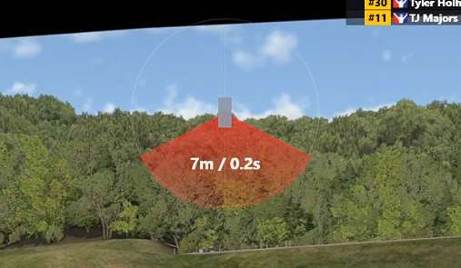
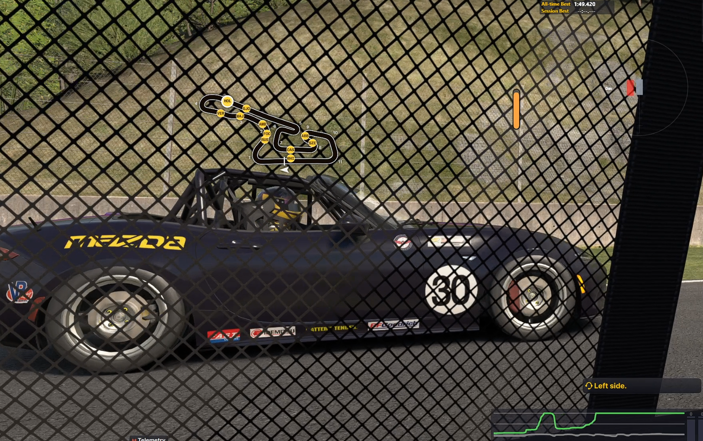

# iRacing Radar for SimHub

一个用于 iRacing 的 SimHub 车辆雷达覆盖层。下载编译好的发布包后，只需要把 DLL、配置文件和 overlay 文件复制到 SimHub 指定目录即可使用。

An iRacing radar overlay for SimHub. Download the prebuilt release package, copy the DLL, settings file, and overlay files into the SimHub folders, then enable the overlay in SimHub.

## 效果预览 / Preview





## 中文说明

### 需要复制哪些文件

发布包里应该包含这些文件：

```text
User.IRacingRadarPlugin.dll
IRacingRadar.settings.ini
iRacing Radar.djson
iRacing Radar.djson.ressources
```

### 文件放在哪里

先关闭 SimHub，然后复制文件。

把插件 DLL 和配置文件放到 SimHub 根目录：

```text
C:\Program Files (x86)\SimHub\User.IRacingRadarPlugin.dll
C:\Program Files (x86)\SimHub\IRacingRadar.settings.ini
```

把 overlay 文件放到 SimHub 的 DashTemplates 目录。没有 `iRacing Radar` 文件夹就手动创建：

```text
C:\Program Files (x86)\SimHub\DashTemplates\iRacing Radar\iRacing Radar.djson
C:\Program Files (x86)\SimHub\DashTemplates\iRacing Radar\iRacing Radar.djson.ressources
```

复制完成后：

1. 启动 SimHub。
2. 在 SimHub 插件列表中启用 **iRacing Radar**。
3. 在 Dash Studio / Overlays 中启动 **iRacing Radar**。
4. 启动 iRacing。建议使用无边框或窗口模式，方便 Windows overlay 正常显示。

### 配置文件位置

推荐把配置文件放在 DLL 同目录：

```text
C:\Program Files (x86)\SimHub\IRacingRadar.settings.ini
```

插件会优先读取这个文件。如果找不到，会兼容旧位置：

```text
%USERPROFILE%\Documents\iRacingRadar\IRacingRadar.settings.ini
%USERPROFILE%\Documents\iraing_Rader\IRacingRadar.settings.ini
```

### 配置项说明

```ini
DisplayMode=Both
```

控制前后车辆文字显示和触发方式。

- `Distance`：按距离触发，只显示米数。
- `Time`：按时间差触发，只显示秒数。
- `Both`：距离或时间差任一条件满足就显示，同时显示米数和秒数。

```ini
RadarRangeMeters=70
```

距离提示范围，单位是米。`DisplayMode=Distance` 时使用这个值；`DisplayMode=Both` 时它会和时间差条件一起判断，哪个先满足就触发显示。

```ini
TimeAlertSeconds=3.0
```

时间差提示范围，单位是秒。`DisplayMode=Time` 时使用这个值；`DisplayMode=Both` 时它会和距离条件一起判断。`DisplayMode=Distance` 时忽略这个值。

```ini
NearDistanceMeters=20
```

近距离红色警示范围，单位是米。前后车辆进入这个范围后，雷达会从绿色提示逐渐变成红色警示。

```ini
OverlayOpacity=92
```

雷达整体透明度，范围建议 `0` 到 `100`。数值越大越明显。

```ini
LabelFontSize=22
```

前后车辆距离/时间文字大小。

```ini
HideDelaySeconds=0.8
```

附近没有车辆后，雷达延迟隐藏的时间，单位是秒。数值越大，雷达消失越慢。

## English

### Files to copy

The prebuilt release package should include these files:

```text
User.IRacingRadarPlugin.dll
IRacingRadar.settings.ini
iRacing Radar.djson
iRacing Radar.djson.ressources
```

### Where to put the files

Close SimHub first, then copy the files.

Put the plugin DLL and settings file in the SimHub root folder:

```text
C:\Program Files (x86)\SimHub\User.IRacingRadarPlugin.dll
C:\Program Files (x86)\SimHub\IRacingRadar.settings.ini
```

Put the overlay files in the SimHub DashTemplates folder. Create the `iRacing Radar` folder if it does not exist:

```text
C:\Program Files (x86)\SimHub\DashTemplates\iRacing Radar\iRacing Radar.djson
C:\Program Files (x86)\SimHub\DashTemplates\iRacing Radar\iRacing Radar.djson.ressources
```

After copying:

1. Start SimHub.
2. Enable the **iRacing Radar** plugin.
3. Start **iRacing Radar** from Dash Studio / Overlays.
4. Start iRacing. Borderless or windowed mode is recommended for Windows overlays.

### Settings file location

Recommended location:

```text
C:\Program Files (x86)\SimHub\IRacingRadar.settings.ini
```

The plugin reads this file first because it is next to `User.IRacingRadarPlugin.dll`. If it is missing, the plugin falls back to these legacy locations:

```text
%USERPROFILE%\Documents\iRacingRadar\IRacingRadar.settings.ini
%USERPROFILE%\Documents\iraing_Rader\IRacingRadar.settings.ini
```

### Settings

```ini
DisplayMode=Both
```

Controls front/rear text display and alert triggering.

- `Distance`: trigger by distance and show meters only.
- `Time`: trigger by time gap and show seconds only.
- `Both`: trigger when either distance or time gap condition is met, and show both values.

```ini
RadarRangeMeters=70
```

Distance alert range in meters. Used when `DisplayMode=Distance`; combined with the time condition when `DisplayMode=Both`.

```ini
TimeAlertSeconds=3.0
```

Time-gap alert range in seconds. Used when `DisplayMode=Time`; combined with the distance condition when `DisplayMode=Both`. Ignored when `DisplayMode=Distance`.

```ini
NearDistanceMeters=20
```

Close-warning range in meters. Front/rear alerts gradually change from green to red inside this range.

```ini
OverlayOpacity=92
```

Overall radar opacity. Recommended range is `0` to `100`. Higher values are more visible.

```ini
LabelFontSize=22
```

Font size for front/rear distance and time labels.

```ini
HideDelaySeconds=0.8
```

Delay before hiding the radar after nearby cars leave, in seconds.

## License

MIT License. See [LICENSE.md](LICENSE.md).